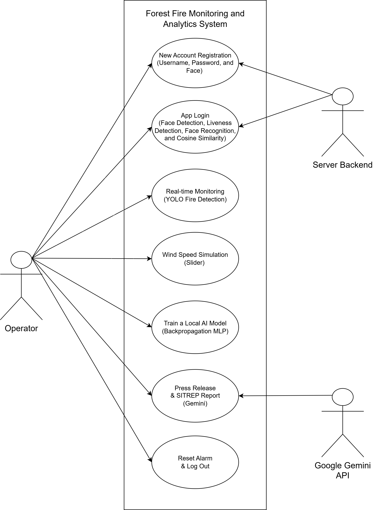
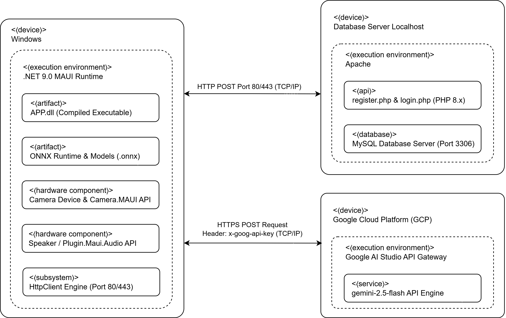
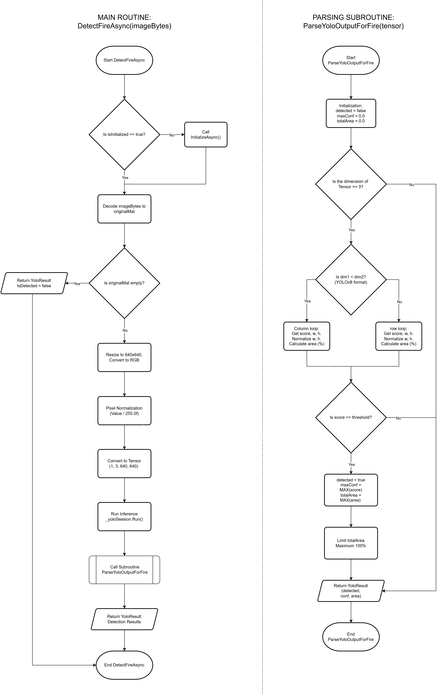
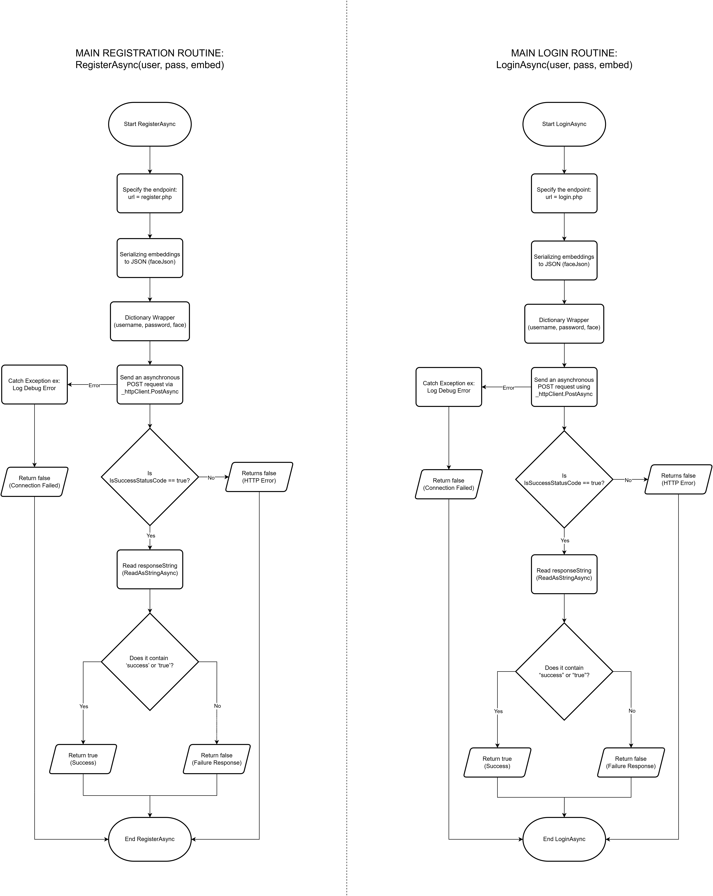
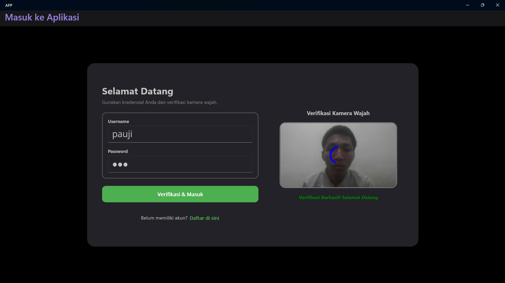

<div align="center">

# SISTEM DAN METODE PEMANTAUAN KEBAKARAN BERBASIS KECERDASAN ARTIFISIAL TEPI HIBRIDA DENGAN GERBANG BIOMETRIK

### Implementasi Sistem Cerdas Terdistribusi Menggunakan .NET 9 untuk Pemantauan Multi-Faktor dan Deteksi Dini Luring

<br>


<br><br>

</div>

---

# 👨‍💻 Pencipta

Sistem ini dikembangkan dan didaftarkan sebagai Hak Kekayaan Intelektual (HKI) oleh tim inventor resmi berikut:

| Nama Inventor | Afiliasi / Institusi | Peran |
|---|---|---|
| **Ahmad Fauzi Abdul Razzaq** | Institut Teknologi Sepuluh Nopember (ITS) | Pencipta Utama / Pengembang Perangkat Lunak |
| **Ir. Dwi Oktavianto Wahyu Nugroho, S.T., M.T.** | Institut Teknologi Sepuluh Nopember (ITS) | Dosen Pembimbing / Pencipta Pendamping |

**Departemen Teknik Instrumentasi**  
**Fakultas Teknologi Industri dan Rekayasa Sistem (FTIRS)**  
**Institut Teknologi Sepuluh Nopember (ITS), Surabaya, Indonesia**

---

# 📘 Deskripsi Ciptaan

Karya cipta ini merupakan program komputer pelacak kebakaran hutan dan lahan berjudul **SISTEM DAN METODE PEMANTAUAN KEBAKARAN BERBASIS KECERDASAN ARTIFISIAL TEPI HIBRIDA DENGAN GERBANG BIOMETRIK**. 

Untuk mengamankan terminal fisik di lapangan, program ini mengintegrasikan fitur keamanan otentikasi multi-faktor biometrik wajah (SCRFD, MiniFASNet, ArcFace) yang berjalan sepenuhnya luring. Deteksi visual jejak api dilakukan secara luring menggunakan model YOLOv8 lokal teroptimasi dengan latensi rendah (< 19 ms). Sistem ini menerapkan penalaran bahaya hibrida untuk menghitung Indeks Bahaya waktu-nyata berbasis logika fuzzy Takagi-Sugeno orde ke-0 serta memprediksi laju penyebaran api (hektar/jam) menggunakan Multi-Layer Perceptron (MLP) yang dilatih secara lokal. 

Guna mendukung koordinasi bencana, telemetri tervalidasi dikirim secara asinkron ke API Google Gemini 2.5 Flash untuk menghasilkan laporan situasi bencana formal secara otomatis. Apabila terjadi kendala koneksi, sistem menyediakan fitur fallback berupa penyimpanan cadangan telemetri lokal menggunakan SQLite demi menjamin kontinuitas data.

---

# ✨ Fitur Utama Aplikasi

Sistem terintegrasi ini dirancang dengan lima pilar fitur utama untuk menjaga keandalan operasi di area terpencil:

1. **Otentikasi Biometrik Tepi Luring (Offline Edge Biometric Gateway):**
   * **SCRFD:** Deteksi wajah multi-skala berkecepatan tinggi langsung pada perangkat *edge*.
   * **MiniFASNet (Liveness Detection):** Proteksi berlapis terhadap serangan pemalsuan identitas (*spoofing*) seperti replika cetak foto maupun video interaktif.
   * **ArcFace:** Mengekstraksi fitur wajah menjadi representasi vektor 512-dimensi yang sangat diskriminatif untuk pembandingan identitas luring berakurasi tinggi.
2. **Deteksi Visual Tepi Real-Time (YOLOv8 Local Inference):**
   * Deteksi kontur api, kepulan asap, dan anomali termal berbasis model YOLOv8 lokal dalam format ONNX Runtime dengan latensi inferensi di bawah 19 ms.
3. **Jembatan Penalaran Hibrida (Hybrid AI Reasoning Bridge):**
   * **Logika Fuzzy Takagi-Sugeno Orde ke-0:** Menghasilkan Indeks Bahaya Kebakaran yang objektif secara *real-time* berdasarkan masukan sensor multi-parameter.
   * **Multi-Layer Perceptron (MLP):** Jaringan saraf tiruan lokal yang bertugas memproyeksikan laju perluasan area terdampak api (dalam skala hektar per jam).
4. **Pelaporan Otomatis Bencana (LLM Automated Reporting System):**
   * Komunikasi asinkron non-blokir dengan API Google Gemini 2.5 Flash untuk mengonversi data telemetri mentah menjadi draf laporan formal tanggap bencana terstruktur.
5. **Mekanisme SQLite Fallback:**
   * Apabila jalur komunikasi jaringan nirkabel/satelit terputus, telemetri akan dialihkan secara otomatis ke basis data relasional SQLite lokal untuk mencegah hilangnya data log penting.

---

# 🏗️ Arsitektur Sistem & Algoritme

Integrasi modul kecerdasan artifisial, pemrosesan sensor, serta pelaporan bencana digambarkan melalui diagram arsitektur di bawah ini:

### 1. Diagram Kasus Penggunaan (Use Case Diagram)
Menggambarkan interaksi aktor (operator lapangan dan sistem eksternal) dengan fungsi utama sistem keamanan dan pemantauan.



### 2. Diagram Topologi Penyebaran (Deployment Diagram)
Menunjukkan struktur infrastruktur fisik tempat perangkat lunak berjalan, mulai dari pemrosesan lokal (*edge processing*) hingga integrasi komputasi awan hibrida.



### 3. Alur Kerja Verifikasi Wajah Biometrik
Alur proses ekstraksi dan verifikasi wajah pengguna terminal fisik menggunakan pipa jaringan saraf luring (SCRFD $\rightarrow$ MiniFASNet $\rightarrow$ ArcFace).


### 4. Alur Kerja Deteksi Visual YOLOv8
Tahapan inferensi citra kamera di lapangan untuk mengklasifikasi dan melacak keberadaan titik api atau asap secara lokal.



### 5. Alur Kerja API Gemini & Sinkronisasi
Mekanisme pengolahan laporan otomatis serta manajemen penyimpanan cadangan saat terjadi kegagalan koneksi.



### 6. Dokumentasi Antarmuka Sistem
Visualisasi halaman verifikasi wajah dan pengelolaan operator pada aplikasi gerbang biometrik terminal fisik.



---

# 🛠️ Prasyarat Sistem (Prerequisites)

Sebelum melakukan kompilasi dan menjalankan sistem, pastikan lingkungan pengembangan Anda memenuhi kriteria berikut:

* **Platform SDK:** .NET 9.0 SDK atau versi di atasnya.
* **Bahasa Pemrograman:** C# 13.
* **IDE Terkompatibilitas:** 
  * Visual Studio 2022 (v17.12 atau versi lebih baru) dengan beban kerja *.NET Desktop Development*.
  * JetBrains Rider atau Visual Studio Code dengan ekstensi C# Dev Kit.
* **Runtime Dependencies:**
  * ONNX Runtime Native Libraries (untuk akselerasi GPU CUDA/DirectML pada inferensi YOLOv8, SCRFD, dan ArcFace).
  * SQLite 3 Engine Core.

---

# 🚀 Petunjuk Instalasi & Cara Menjalankan

### 1. Klon Repositori
Lakukan klon repositori proyek ini ke direktori lokal Anda:
```bash
git clone https://github.com/username/repo-name.git
cd repo-name
```

### 2. Konfigurasi Sistem (`ApiConfig.cs`)
Buat atau perbarui file konfigurasi API di dalam direktori proyek (`src/Config/ApiConfig.cs`) untuk mengatur API Key Gemini dan jalur penyimpanan basis data lokal:

```csharp
namespace FireMonitoringSystem.Config
{
    public static class ApiConfig
    {
        // Kunci API untuk otentikasi layanan Google Gemini LLM
        public const string GeminiApiKey = "MASUKKAN_API_KEY_GEMINI_ANDA";

        // Jalur koneksi basis data SQLite lokal untuk mekanisme fallback
        public const string SqliteConnectionString = "Data Source=LocalDatabase/telemetry_fallback.db;Cache=Shared";

        // Ambang batas persentase kemiripan wajah minimum pada model ArcFace (0.0f - 1.0f)
        public const float FaceSimilarityThreshold = 0.65f;

        // Path direktori lokal tempat menyimpan berkas model ONNX (YOLOv8, SCRFD, ArcFace, MiniFASNet)
        public const string ModelDirectoryPath = @"./Assets/Models/";
        
        // Target Latensi Inferensi Maksimum (ms)
        public const double TargetInferenceLatencyMs = 19.0;
    }
}
```

### 3. Restorasi dan Kompilasi Proyek
Lakukan restorasi pustaka dependensi NuGet, lalu bangun aplikasi dalam konfigurasi rilis untuk performa optimal:
```bash
# Mengunduh dependensi NuGet yang diperlukan
dotnet restore

# Mengompilasi aplikasi dengan optimasi performa penuh
dotnet build --configuration Release
```

### 4. Eksekusi Program
Jalankan program utama melalui terminal atau CLI .NET:
```bash
dotnet run --project src/FireMonitoringSystem.csproj --configuration Release
```

---

# 📊 Parameter Logika Sistem

| Parameter / Konfigurasi | Nilai Acuan | Deskripsi Operasional |
|---|---|---|
| **Target Latensi Inferensi** | < 19 ms | Batas waktu maksimum eksekusi YOLOv8 pada edge device |
| **Model Deteksi Wajah** | SCRFD_2.5G_KPS[[6](https://www.google.com/url?sa=E&q=https%3A%2F%2Fvertexaisearch.cloud.google.com%2Fgrounding-api-redirect%2FAUZIYQE8O1xh2vzzEFMPH7_sqwPiJ-SX0sTF_RxW5nR1zFuNcX5TSgDNJxf_Y2CyWihTxWORqzHTyUQrC-AImy3XVuGm25KlV-0W9uXm2o91cC-LgbnWP8HLxIFyg-X9KN4T)] | Menghasilkan koordinat pembatas dan 5 titik penanda wajah[[1](https://www.google.com/url?sa=E&q=https%3A%2F%2Fvertexaisearch.cloud.google.com%2Fgrounding-api-redirect%2FAUZIYQFv1QvRG3hrOHbSCjpDHWMhixySEAXtdqKHSoTQd09BNIQm7kfGwkiUezhYcmjhO39SOXMeyXY3B8qkQGMlr-QyQ5EI8Qb5qBq8D76WF-AAlM4wL4oNkZdx-f_v2vOGLDtLJjLodkS_vjDZ6NhpJzgInchC3Mw3U-2G0VvMAj9cdSoerCyp8xttaPohluJmeCwLLQWSdCJBgNL8N5Vj6V_4MrD5xHzsXAttytie4Oglc_YYIg%3D%3D)][[7](https://www.google.com/url?sa=E&q=https%3A%2F%2Fvertexaisearch.cloud.google.com%2Fgrounding-api-redirect%2FAUZIYQEbDxQJAOsKwozeCdsGbR2SWbNC4MUxh9dEnUMPSBRvkbvxwCH8WF4AX6xipMEVEkw5Jfjhtxq8R672SOpBUqa6LxEJ9Hwd2yl7FR38oCuauTtjfPwEIgr_2VYWCfF0T0Vr0hvYhvWkb8esLXw8qERdIn7bTQ7mK50uYF2CggqznShszxYm0hPUs12Zq1r7nQEbdC00Vryt8tIr4k2uIGUpOYHcJcRXUjrDKivHC73IVJcAn0CGbjv2avmHJlLpkmzWhrWwLzO0dJhkktZv34scddD8tsU%3D)] |
| **Model Deteksi Pemalsuan** | MiniFASNet | Menganalisis keaslian wajah (Liveness Detection) secara lokal |
| **Ambang Batas ArcFace** | Cosine Similarity $\ge$ 0.65 | Parameter penentu otorisasi operator terdaftar |
| **Tipe Logika Fuzzy** | Takagi-Sugeno Orde ke-0 | Mengonversi masukan multisensor menjadi indeks bahaya 0-100% |
| **Metode Estimasi Area** | Multi-Layer Perceptron | Prediksi laju ekspansi titik api dalam skala hektar/jam |
| **Engine Penyimpanan Cadangan**| SQLite (Offline-First) | Buffer telemetri asinkron ketika jaringan internet terputus |

---

# 🔐 Hak Cipta & Lisensi

Hukum perlindungan kekayaan intelektual Republik Indonesia melindungi penuh seluruh komponen program komputer ini:

* **Pemegang Hak Cipta:** Ahmad Fauzi Abdul Razzaq & Institut Teknologi Sepuluh Nopember (ITS).
* **Undang-Undang Perlindungan:** Dilindungi berdasarkan UU No. 28 Tahun 2014 tentang Hak Cipta.

*Dilarang keras menyalin, memodifikasi, mendistribusikan, atau mempergunakan kode sumber ini untuk kepentingan komersial tanpa izin tertulis dari pihak pemegang hak cipta dan Institut Teknologi Sepuluh Nopember (ITS).*

---
<div align="center">

**Sistem Pemantauan Kebakaran Hutan dan Lahan Berbasis Kecerdasan Artifisial Tepi Hibrida**  
*Inovasi Teknologi Instrumentasi untuk Keselamatan dan Pelestarian Lingkungan Indonesia.*

</div>
